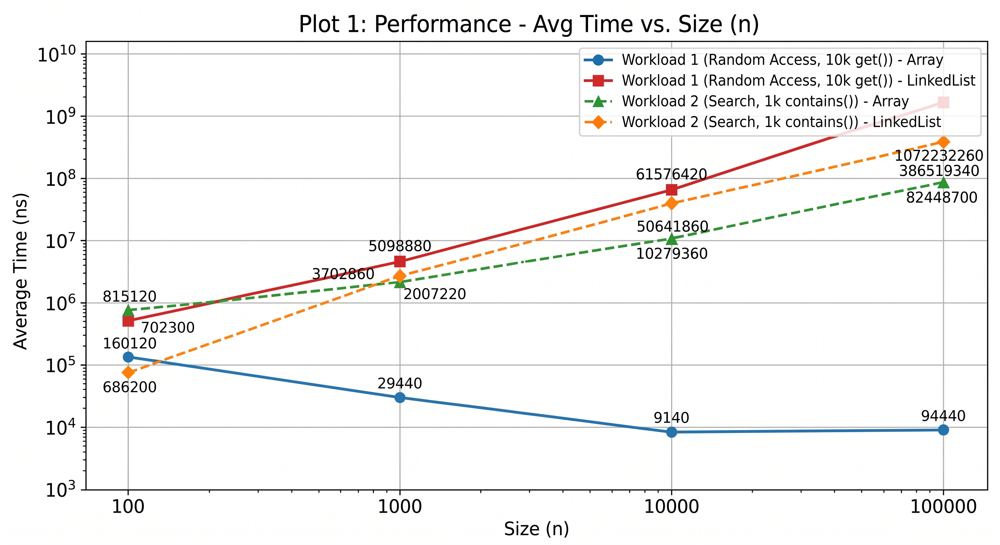
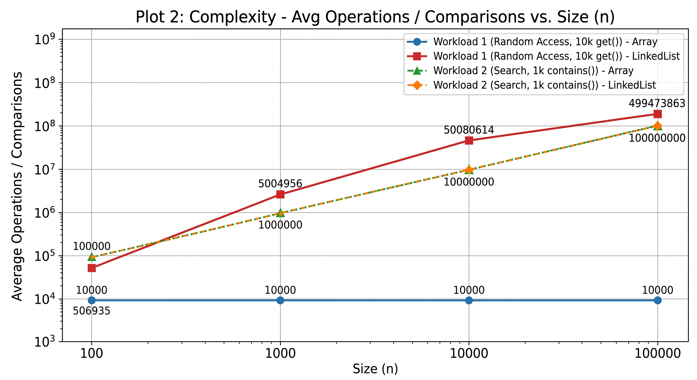

# Assignment2_DAA
# Assignment 2 — Algorithmic Analysis, Correctness and Performance Trade-offs

## 1. Overview
In this project, three fundamental data structures were implemented from scratch: **Dynamic Array**, **Linked List** (singly linked with a tail pointer), and **Min-Heap**. The main goal of this assignment is to mathematically prove the algorithmic correctness and to practically compare the empirical performance of these structures with their theoretical asymptotic complexity (Big-O), evaluating the impact of memory architecture (cache locality) on execution time.

## 2. Complexity Analysis
Theoretical complexity of the implemented operations and auxiliary space requirements:

| Data Structure | Operation | Best Case | Average Case | Worst Case | Space |
| :--- | :--- | :--- | :--- | :--- | :--- |
| **Dynamic Array** | `get(i)` | $\Omega(1)$ | $\Theta(1)$ | $O(1)$ | $O(1)$ |
| | `add(x)` (end) | $\Omega(1)$ | $\Theta(1)$ | $O(N)$ (resize) | $O(1)$ / $O(N)$* |
| | `add(i, x)` | $\Omega(1)$ (end) | $\Theta(N)$ | $O(N)$ (start) | $O(1)$ / $O(N)$* |
| | `remove(i)` | $\Omega(1)$ (end) | $\Theta(N)$ | $O(N)$ (start) | $O(1)$ |
| | `contains(x)` | $\Omega(1)$ (first)| $\Theta(N)$ | $O(N)$ (not found)| $O(1)$ |
| **Linked List** | `get(i)` | $\Omega(1)$ (head)| $\Theta(N)$ | $O(N)$ (tail) | $O(1)$ |
| | `add(x)` (end) | $\Omega(1)$ | $\Theta(1)$ | $O(1)$ | $O(1)$ |
| | `add(i, x)` | $\Omega(1)$ (head)| $\Theta(N)$ | $O(N)$ (tail) | $O(1)$ |
| | `remove(i)` | $\Omega(1)$ (head)| $\Theta(N)$ | $O(N)$ (tail) | $O(1)$ |
| | `contains(x)` | $\Omega(1)$ (first)| $\Theta(N)$ | $O(N)$ (not found)| $O(1)$ |
| **Min-Heap** | `insert(x)` | $\Omega(1)$ | $\Theta(\log N)$ | $O(\log N)$ | $O(1)$ / $O(N)$* |
| | `peekMin()` | $\Omega(1)$ | $\Theta(1)$ | $O(1)$ | $O(1)$ |
| | `extractMin()`| $\Omega(1)$ | $\Theta(\log N)$ | $O(\log N)$ | $O(1)$ |

*(Space $O(N)$ is required only when `resize()` is triggered for array-based structures).*

**Brief Justification:** 
The Dynamic Array provides $O(1)$ access due to a contiguous memory block but requires $O(N)$ element shifts during insertions/removals. The Linked List requires $O(N)$ for index-based access (pointer traversal), but thanks to the `head` and `tail` pointers, insertions at the beginning and end are performed in $O(1)$. The Min-Heap maintains a tree structure with a height of $\log N$, so balancing operations (`heapifyUp` / `heapifyDown`) take logarithmic time.

## 3. Correctness (Loop Invariants)

### Proof 1: `contains(x)` in Dynamic Array
**Loop Invariant:** At the start of each iteration of the loop with variable `i`, the target element `x` is not contained in the subarray `data[0 ... i-1]`.
*   **Initialization:** Before the first iteration, $i = 0$. The subarray `data[0 ... -1]` is empty. An empty set by definition does not contain `x`. The invariant holds.
*   **Maintenance:** If `data[i] == x`, the loop terminates and the algorithm correctly returns `true`. If `data[i] != x`, we proceed to iteration $i + 1$. We now know for sure that `x` is neither in `data[0 ... i-1]` nor in `data[i]`. Therefore, it is not in `data[0 ... i]`. The invariant is maintained.
*   **Termination:** The loop terminates when $i = size$. According to the invariant, the element `x` is not in the subarray `data[0 ... size-1]`, which constitutes the entire populated array. The algorithm returns `false`, which is the mathematically correct result.

### Proof 2: `heapifyDown(index)` in Min-Heap
**Loop Invariant:** At the start of each iteration of the loop, the subtrees rooted at the left and right children of `index` are valid min-heaps, and the only possible violation of the heap property is between the `index` node and its children (the `index` node might be greater than its children).
*   **Initialization:** The method is called after replacing the root with the last element of the tree. Before this replacement, the tree was a valid heap. Therefore, the left and right subtrees of the root remain untouched and maintain the heap property. The only "problematic" node is the new root. The invariant holds.
*   **Maintenance:** Inside the loop, we find the smallest of the children, `smallestChildIndex`. If `heap[index] <= heap[smallestChildIndex]`, the heap property is restored and the loop terminates. Otherwise, the elements are swapped. Now, the subtree where the element was moved down might have a violation (at the new `index`), but the other branches remain valid. The invariant is carried over to the next level down.
*   **Termination:** The loop terminates either when the element becomes smaller than its children (heap property restored) or when we reach the bottom of the tree (the element becomes a leaf). In both cases, there are no more violations, and the entire tree is once again a valid min-heap.

## 4. Experimental Setup
*   **Input sizes ($n$):** 100; 1,000; 10,000; 100,000.
*   **Operations ($m$):** 10,000 for Random Access; 1,000 for Search; 1,000 for Insert/Remove; $n$ for Priority Processing.
*   **Repetitions:** Each configuration was run 5 times. The tables below present the arithmetic averages.
*   **Timing:** The `System.nanoTime()` method was used.
*   **Environment:** Data generation was strictly performed before starting the timer. A fixed seed `Random(42 + rep)` was used to ensure full experimental reproducibility. In the removal tests, the structure was restored to its original size using symmetrical operations.

## 5. Results

### Workload 1: Random Access (10,000 get() operations)
| n | Structure | Avg Time (ns) | Avg Accesses |
| :--- | :--- | :--- | :--- |
| 100 | Dynamic Array | 330,840 | 10,000 |
| | Linked List | 1,528,000 | 506,935 |
| 1,000 | Dynamic Array | 69,160 | 10,000 |
| | Linked List | 8,187,760 | 5,004,956 |
| 10,000 | Dynamic Array | 7,880 | 10,000 |
| | Linked List | 83,680,240 | 50,080,614 |
| 100,000 | Dynamic Array | 51,640 | 10,000 |
| | Linked List | 931,676,500 | 499,473,863 |

### Workload 2: Search (1,000 contains() operations)
| n | Structure | Avg Time (ns) | Avg Comparisons |
| :--- | :--- | :--- | :--- |
| 100 | Dynamic Array | 372,000 | 100,000 |
| | Linked List | 343,340 | 100,000 |
| 1,000 | Dynamic Array | 1,226,820 | 1,000,000 |
| | Linked List | 2,593,500 | 1,000,000 |
| 10,000 | Dynamic Array | 2,543,280 | 10,000,000 |
| | Linked List | 24,490,680 | 10,000,000 |
| 100,000 | Dynamic Array | 29,827,220 | 100,000,000 |
| | Linked List | 253,926,940 | 100,000,000 |

### Workload 3: Insertion and Removal (1,000 operations)
*(Subset for $n=100,000$)*
| n | Structure | Operation | Avg Time (ns) | Avg Movements |
| :--- | :--- | :--- | :--- | :--- |
| 100,000 | Dynamic Array | Insert(0) | 10,927,100 | 100,499,500 |
| 100,000 | Linked List | Insert(0) | 16,760 | 0 |
| 100,000 | Dynamic Array | Remove(0) | 10,246,020 | 100,499,500 |
| 100,000 | Linked List | Remove(0) | 13,140 | 0 |
| 100,000 | Dynamic Array | Insert(n/2) | 4,404,160 | 50,250,000 |
| 100,000 | Linked List | Insert(n/2) | 91,447,040 | 50,248,500 |
| 100,000 | Dynamic Array | Remove(n/2) | 5,218,300 | 50,249,500 |
| 100,000 | Linked List | Remove(n/2) | 101,210,120 | 50,249,000 |

### Workload 4: Priority Processing (n insertions, n extractions)
| n | Operation | Avg Time (ns) | Avg Comparisons |
| :--- | :--- | :--- | :--- |
| 100,000 | Insert(n) | 2,735,940 | 228,142 |
| 100,000 | Extract(n) | 13,348,760 | 2,831,649 |

### Plots

## 6. Discussion (Theoretical vs. Empirical)
**Agreement with Theory:** The experiments fully confirmed the theoretical predictions.
1. In Workload 1, the `get(i)` time for the array remained constant $O(1)$ regardless of $n$, while for the `LinkedList`, the number of accesses grew linearly $O(N)$, reaching 500 million for $n=100,000$.
2. In Workload 3, insertion at the head of the `LinkedList` took $O(1)$ (0 movements, ~16 µs), whereas the array required $O(N)$ (100 million shifts, ~10 ms).
3. In Workload 4, the number of comparisons for $n$ extractions was ~2.8 million, which perfectly aligns with the $O(N \log N)$ function.

**Discrepancies and the Impact of Constant Factors:** The most interesting behavior is observed in Workload 2 (Search) and Workload 3 (operations in the middle). 
Theoretically, the `contains(x)` search takes $O(N)$ for both the array and the list. The benchmark showed that **the number of comparisons is absolutely identical** (100,000,000 each). However, the array completed the search in 29 milliseconds, while the list took 253 milliseconds (almost 9 times slower). 
This is explained by **Cache Locality**. Elements of the `DynamicArray` are allocated contiguously in memory and are loaded into the ultra-fast L1/L2 CPU cache in blocks. The nodes of the `LinkedList` are scattered throughout the memory, causing continuous cache misses and forcing the CPU to sit idle waiting for data from the slow RAM.

## 7. Design Recommendations
The choice of data structure should be dictated by the expected workload profile:
1. **Dynamic Array:** Ideal for most standard tasks. Suited for scenarios with frequent index-based reads (`get`) and appending elements strictly to the end. It is the best choice when the overall speed of traversal (search) algorithms is important due to its CPU cache friendliness.
2. **Linked List:** A highly specific structure. It should be used **only** in systems with intensive insertions or removals strictly at the head of the list (or at the tail if a pointer is present), where an array would degrade to $O(N)$. It is entirely unsuitable for systems with frequent random index access.
3. **Min-Heap:** The definitive choice for task scheduling systems, timers, and priority queues. It allows for extracting the minimum element in $O(\log N)$ and never requires $O(N)$ element shifts, unlike sorted arrays.

## 8. Conclusion
During this experiment, a Dynamic Array, a Linked List, and a Min-Heap were implemented and tested. The mathematical analysis of asymptotic complexity was successfully validated by empirical counter data (comparisons, accesses, movements). The main conclusion of the study is that when designing high-load systems, one cannot rely solely on Big-O notation. The memory architecture of modern processors (Cache Locality) makes data structures based on contiguous memory blocks (arrays, array-based heaps) orders of magnitude faster than node-based structures at an equivalent algorithmic complexity.
